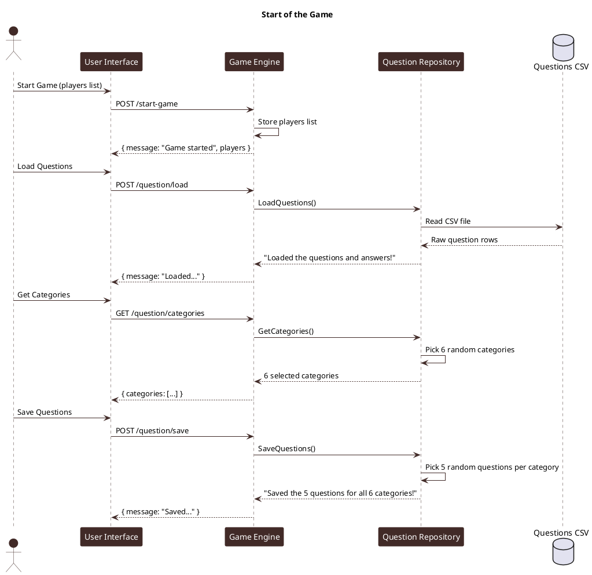
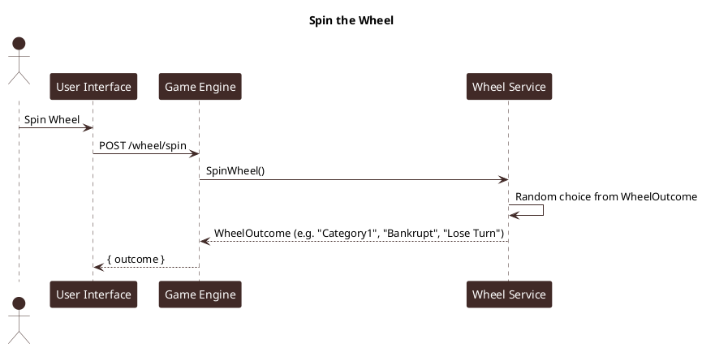
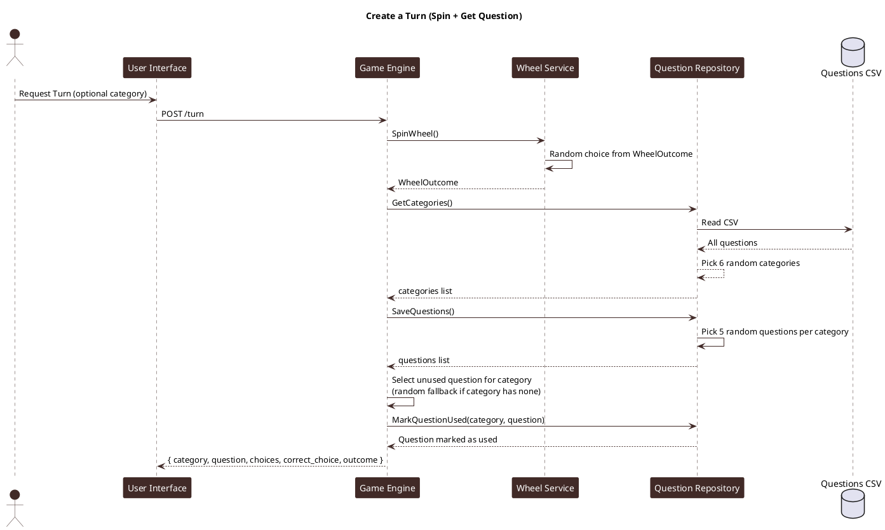
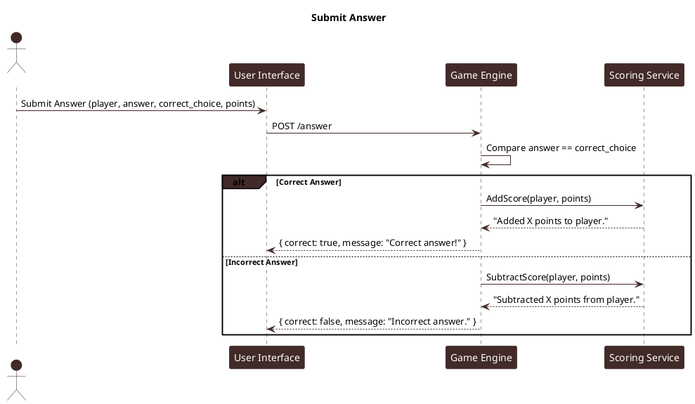
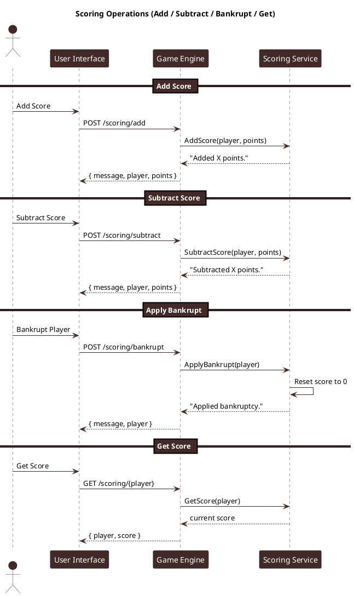
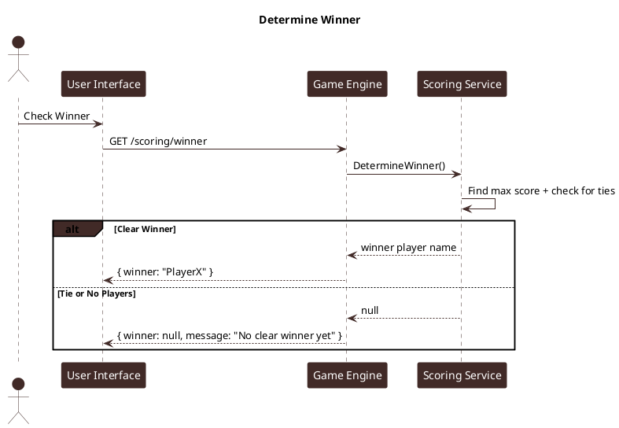
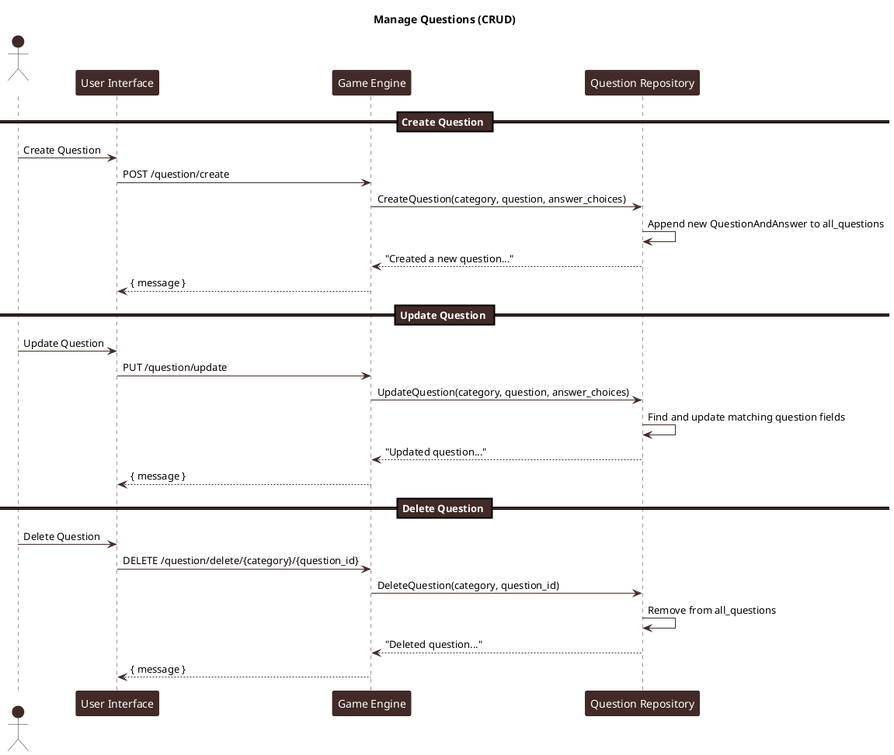

# Backend Sequence Diagrams

## Start of the Game

## Spin the Wheel

## Create a Turn (Spin + Get Question)

## Submit Answer

## Scoring Operations (Add / Subtract / Bankrupt / Get)

## Determine Winner

## Manage Questions (CRUD)

